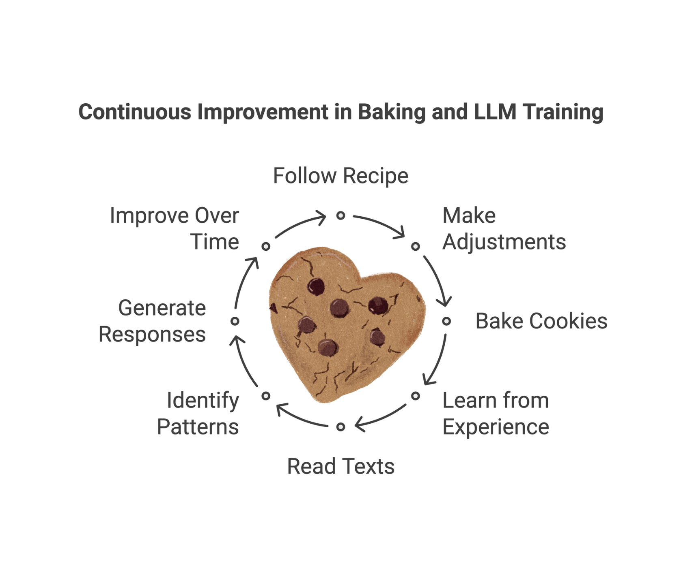

# Generative AI and Large Language Models

## Explain LLM to Your Grandma

Just imagine you are baking some cookies 🍪, Grandma. You have a great cookie recipe that everybody likes so much 🤗,
and over many years, you've learned how to make adjustments to it, bake it more for a longer period of time, or may add
a bit more sugar in it. You are good at it because you have made cookies for many times. 😇

Now, think of an LLM or Large Language Model, like a huge recipe book 📖 for words and sentences. Instead of cookies,
it "bakes" sentences, 🔖 replies to queries, or helps with tasks using patterns that it has learned from reading so many
books, web pages, and conversations 🪶 - just like you became good at baking cookies from experience. 🕊️

So, in short, an LLM is a super-smart tool that can talk, write, and help with all kinds of things by understanding how
we humans use words. It's not completely perfect yet, but it gets better the more it "practices", just like your cookie
recipe gets better over time, Grandma! ❤️

